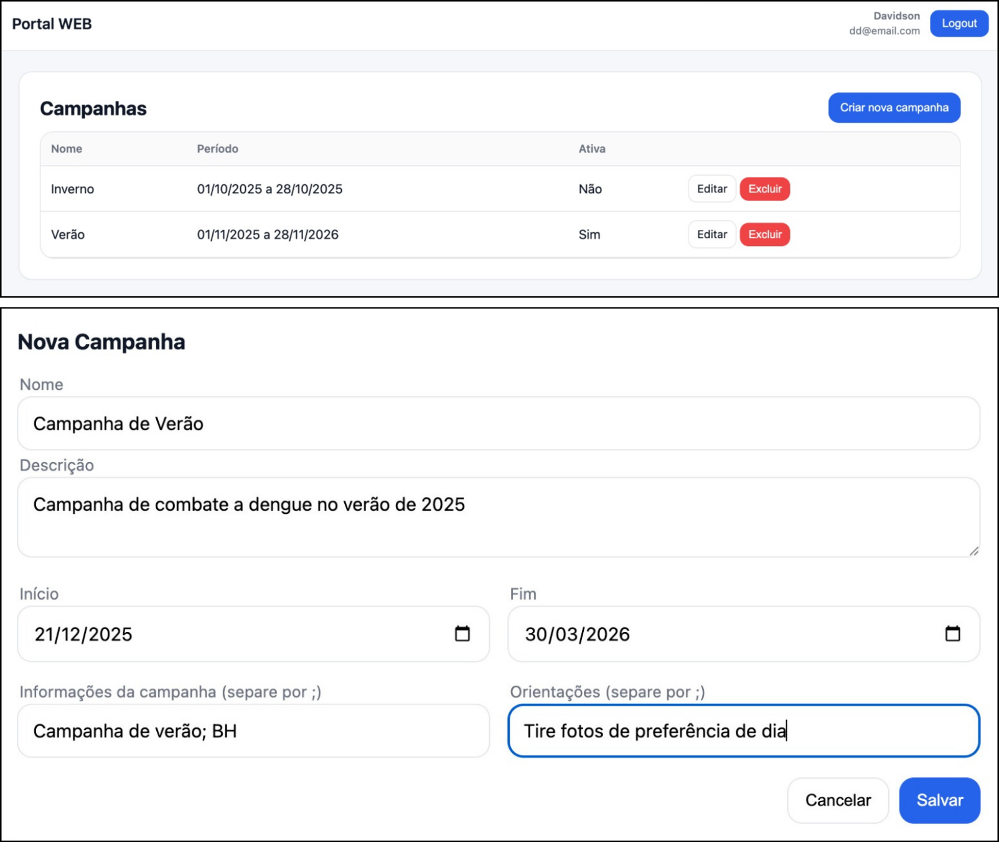
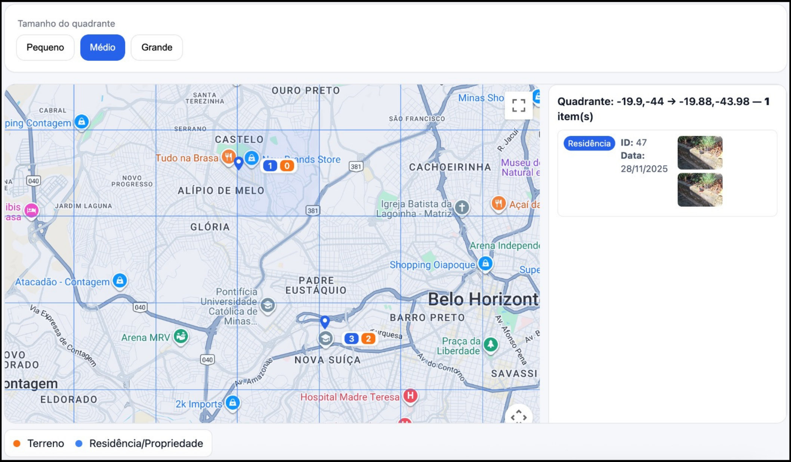
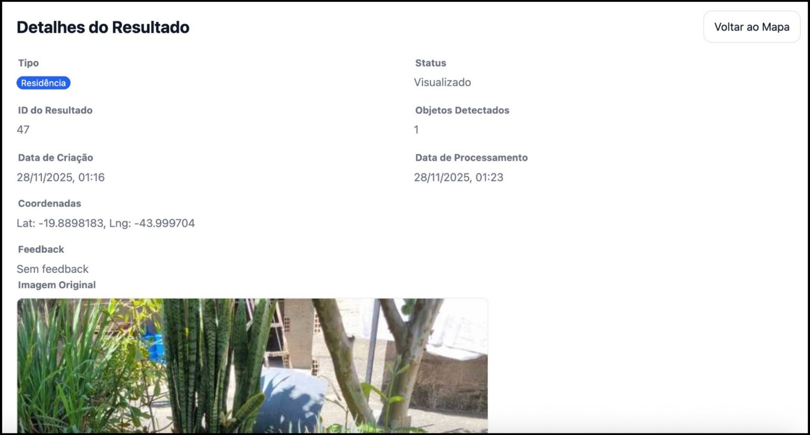

# Portal Web - Sistema de Detecção de Criadouros de Aedes aegypti

Sistema web desenvolvido para gestores de saúde municipal visualizarem e gerenciarem detecções de potenciais criadouros do mosquito **Aedes aegypti** através de um mapa interativo e painel de campanhas.

## 📋 Sobre o Projeto

Este portal faz parte de um sistema integrado de combate ao **Aedes aegypti** que utiliza **visão computacional** e **inteligência artificial** para identificar automaticamente potenciais criadouros do mosquito em imagens enviadas pela população através de um aplicativo móvel.

O sistema foi desenvolvido como Trabalho de Conclusão de Curso (TCC) em Engenharia de Computação da PUC Minas, utilizando a arquitetura **YOLOv12** para detecção de objetos em imagens.

### 🎯 Objetivo

Fornecer aos gestores de saúde municipal uma ferramenta centralizada para:

- Visualizar detecções georreferenciadas em tempo real
- Criar e gerenciar campanhas de combate às arboviroses
- Identificar áreas com maior concentração de focos
- Apoiar a tomada de decisões estratégicas para alocação de recursos

## 🌐 Acesso ao Portal

**Link de Produção:** [https://deteccao-criadouro.web.app/](https://deteccao-criadouro.web.app/)

### 🔑 Credenciais de Exemplo

Para acessar o portal, utilize as seguintes credenciais:

- **Email:** `dd@email.com`
- **Senha:** `123`

## 🖼️ Imagens do Portal

### Tela de Campanhas

A interface permite criar e gerenciar campanhas de combate às arboviroses, definindo parâmetros como período de duração, área de abrangência geográfica e objetivos específicos.



### Mapa de Detecções

O mapa interativo apresenta de forma georreferenciada todos os locais onde foram detectados potenciais criadouros. Cada ponto no mapa representa uma detecção realizada, permitindo identificar visualmente áreas com maior concentração de focos.



### Detalhes de Detecção

Ao clicar sobre um ponto no mapa, o gestor pode acessar informações detalhadas sobre aquela detecção, incluindo a imagem original, a imagem processada com as marcações, data e hora do registro, e informações do usuário que realizou o envio.



## 🚀 Funcionalidades

### Para Gestores de Saúde

- ✅ **Autenticação segura** com sistema de login
- ✅ **Visualização de mapa interativo** com detecções georreferenciadas
- ✅ **Gerenciamento de campanhas** (criar, editar, visualizar)
- ✅ **Análise de dados** com identificação de áreas prioritárias
- ✅ **Detalhamento de detecções** com imagens processadas
- ✅ **Interface responsiva** e intuitiva

### Fluxo de Funcionamento

1. **Moradores** capturam imagens de seus quintais/terrenos através do aplicativo móvel
2. **Sistema de IA** processa as imagens utilizando o modelo YOLOv12
3. **Detecções** são armazenadas com geolocalização
4. **Gestores** visualizam os resultados no portal web através do mapa interativo

## 🛠️ Tecnologias Utilizadas

### Frontend

- **HTML5** / **CSS3** / **JavaScript (Vanilla)**
- **Google Maps JavaScript API** - Para visualização de mapas
- **SPA (Single Page Application)** com roteamento baseado em hash

### Hospedagem

- **Firebase Hosting** - Hospedagem do portal web

## 📁 Estrutura do Projeto

```
deteccao-criadouro-portal/
├── index.html          # Página principal
├── app.js              # Aplicação SPA (rotas e telas)
├── api.js              # Comunicação com backend
├── data.js             # Gerenciamento de estado (localStorage)
├── map.js              # Componente de mapa
├── admin.js            # Funcionalidades administrativas
├── style.css           # Estilos da aplicação
├── firebase.json       # Configuração do Firebase Hosting
├── images/             # Imagens do portal
│   ├── campanhas.png
│   ├── mapa-deteccoes-v2.jpg
│   └── detalhes-mapa-v2.jpg
└── README.md           # Este arquivo
```

## 🔧 Como Executar Localmente

### Pré-requisitos

- Navegador web moderno (Chrome, Firefox, Edge)
- Servidor HTTP local (opcional, para desenvolvimento)

### Instalação

1. Clone o repositório:

```bash
git clone https://github.com/ICEI-PUC-Minas-EC-TCC/pmg-ec-2025-2-tcc2-detecccao-criadouro-mosquito.git
cd pmg-ec-2025-2-tcc2-detecccao-criadouro-mosquito/portal
```

2. Abra o arquivo `index.html` em um navegador ou use um servidor HTTP local:

```bash
# Usando Python
python -m http.server 8000

# Usando Node.js (http-server)
npx http-server

# Usando PHP
php -S localhost:8000
```

3. Acesse `http://localhost:8000` no navegador

## 🤝 Contribuições

Este é um projeto acadêmico desenvolvido como TCC. Para sugestões ou melhorias, entre em contato com os autores.
